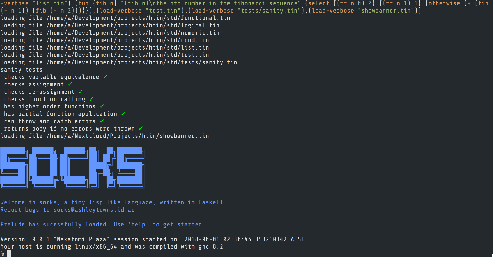

# Socks
Socks is a toy s-expression language written in haskell. 



## Features
Most methods should have builtin documentation, from the repl you can see this by typing the method name

```clojure
% map
(map f l)
Apply the given function f to the items in list l returning the resulting list
(\ {f l} {if (== l nil) {nil} {join (list (f (fst l))) (map f (tail l))}})
% 
```

## Install

Just run `stack install` or `make install` to run the test suite run `make test`

## Usage

Running socks without a filename loads the REPL, giving a file name or using `#!/usr/bin/env socks` (a shebang) at the top of a 
file and making it executable will run it. You can also pipe content to socks for example `echo '(println "Hello")' | socks`.

## Examples

### Higher order functions

```clojure
(= {adder} (\ {x} (+ x 10)))
(map adder {1 2 3 4 5}) 
; {11 12 13 14 15}
```

### Exception handling

```clojure
(catch {eval (error "ohh nooo")} (\ {err} {println (join "an error happened! " (show err))})) 
; an error happened! ohh nooo
```

### Currying

```clojure
(\ {x y} {+ x y})
(= {add} (\ {x y} {+ x y}))
(= {add-10} (add 10))
(add-10 90)
; 100
```

### FFI
This example uses libdiscount to convert markdown text to html. 

```clojure
(= {libmarkdown} (ffi/dlopen "/usr/lib/libmarkdown.so"))
(= {mkd-string-sym} (ffi/dlsym libmarkdown "mkd_string"))
(= {markdown-sym} (ffi/dlsym libmarkdown "markdown"))

(= {libc} (ffi/dlopen "/lib/libc.so.6"))
(= {stdout} (ffi/deref (ffi/dlsym libc "stdout")))
(= {strlen} (ffi/dlsym libc "strlen"))

(= {ffi-strlen} (ffi/call strlen ffi/sint32 {ffi/string}))
(= {ffi-mkd-string} (ffi/call mkd-string-sym ffi/ptr {ffi/string ffi/sint32 ffi/sint32}))
(= {ffi-markdown} (ffi/call markdown-sym ffi/sint32 {ffi/ptr ffi/ptr ffi/sint32}))

(fun {markdown input} "(markdown input)\nconverts and prints the given markdown string to html" { do
  (= {doc} (ffi-mkd-string input (ffi-strlen input) 0))
  (ffi-markdown doc stdout 0)})
```

### Testing

```clojure
(describe "sanity tests"
  { it "checks variable equivalence" (expect #t (to-eq #t)) }
  { it "checks assignment" (= {x} #t) (expect x (to-eq #t)) }
  { it "checks re-assignment" (= {x} #f) (= {x} #t) (expect x (to-eq #t)) }
  { it "checks function calling" (expect (+ 1 1) (to-eq 2)) }
  { it "has higher order functions" 
    (= {adder} (\ {x} {+ x 100}))
    (= {result} (map adder {1 2 3 4 5}))
    (expect result (to-eq {101 102 103 104 105}))
  }
  { it "has partial function application"
    (= {add} (\ {x y} {+ x y}))
    (= {add-10} (add 10))
    (expect (add-10 20) (to-eq 30))
  }
  { it "can throw and catch errors" 
    (= {res} (catch {eval (error "ohh nooo")} (\ {err} {#t})))
    (expect res (to-eq #t))
  }
  { it "returns body if no errors were thrown"
    (= {res} (catch {#t} (\ {err} {#f})))
    (expect res (to-eq #t))
  }
)
```
